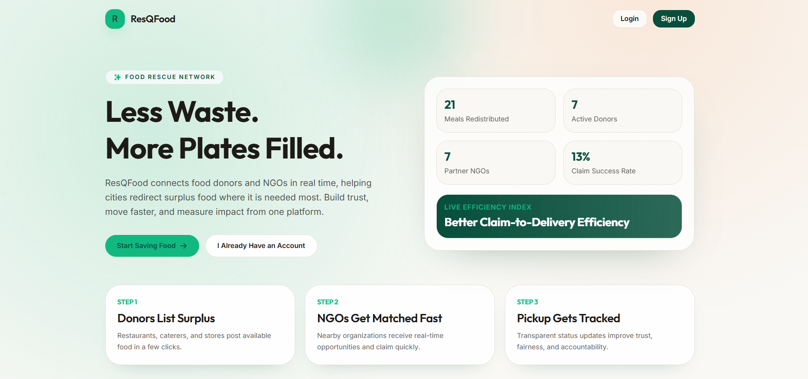
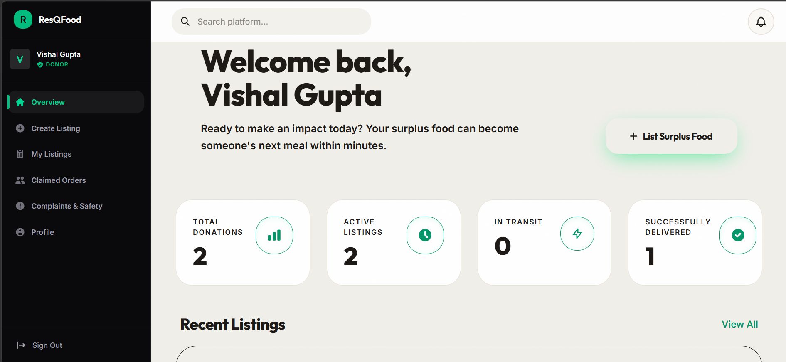
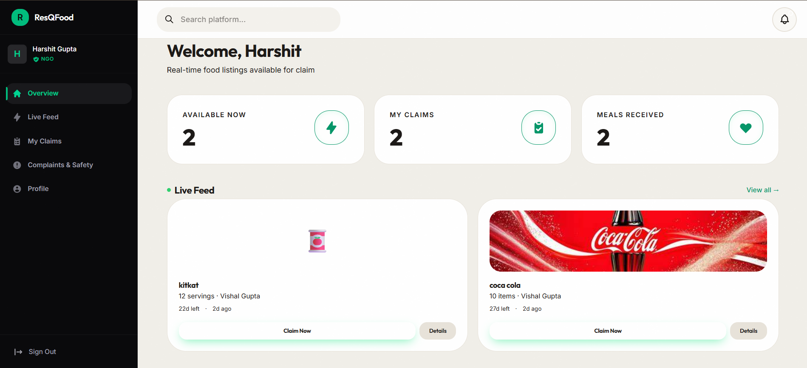
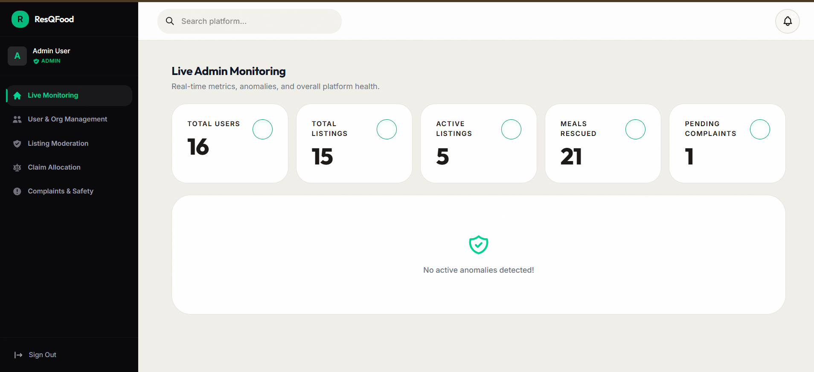

# ResQFood

ResQFood is a full-stack MERN platform that connects food donors, NGOs, and admins to reduce food waste and deliver edible surplus to people who need it.

## Why This Project Matters

Every day, large amounts of good food are wasted while many communities remain food insecure.
ResQFood addresses this gap by creating one digital flow for:

- Donors to list surplus food quickly.
- NGOs to discover and claim available food in real time.
- Admins to moderate quality, resolve disputes, and keep the system fair.

## Live Links

- Frontend (Vercel): https://res-q-food-00.vercel.app/
- Backend (Render): https://resqfood-backend-qqap.onrender.com/
- Health Check: https://resqfood-backend-qqap.onrender.com/api/health

## Product Highlights

- Role-based experience for Donor, NGO, and Admin.
- Real-time listing and claim lifecycle updates via Socket.IO.
- OTP-based delivery confirmation to reduce false completion.
- Complaint center with admin-side resolution workflow.
- AI-assisted donor intake and listing support.
- Analytics dashboard to track platform impact.

## Screenshots


### Complete Architechture


### Home and Public Experience


### NGO (RAG BASED) chat bot


#### for more infomation refer to repo : 


### Dashboard and Listings


### Voice Intake form filling Automation bot

#### for more infomation refer to repo : 


### Claim and Verification Flow


### OTP Verification Flow


### Admin and Moderation Views


## Key Modules by Role

### Donor

- Create listings with quantity, freshness, and pickup details.
- Receive claim activity and delivery verification requests.
- Complete delivery through OTP verification.
- Track contributions and interactions.

### NGO

- Browse available listings.
- Claim suitable food listings.
- Track claim status through the lifecycle.
- Raise complaints when needed.

### Admin

- Monitor platform activity.
- Moderate listings and users.
- Manage claim allocation fairness.
- Resolve complaints and enforce platform trust.

## Local Setup

### 1) Clone

```bash
git clone https://github.com/harshitgupta0910/ResQFood.git
cd ResQFood
```

### 2) Install Dependencies

```bash
cd server
npm install
cd ../client
npm install
```

### 3) Configure Environment Variables

Create these files:

- server/.env
- client/.env (recommended)

### 4) Run Backend

```bash
cd server
npm run dev
```

### 5) Run Frontend

```bash
cd client
npm run dev
```

## Environment Variables

### Backend (server/.env)

Required:

```env
PORT=5000
NODE_ENV=development
MONGO_URI=your_mongodb_connection_string
JWT_SECRET=your_jwt_secret
JWT_EXPIRE=7d
CLIENT_URL=http://localhost:5173
BACKEND_BASE_URL=http://localhost:5000
```

Email and OTP:

```env
EMAIL_HOST=
EMAIL_PORT=587
EMAIL_USER=
EMAIL_PASS=
EMAIL_FROM_NAME=ResQFood
EMAIL_FROM=
```

Cloudinary:

```env
CLOUDINARY_CLOUD_NAME=
CLOUDINARY_API_KEY=
CLOUDINARY_API_SECRET=
```

```env
OPEN_ROUTER=
OPEN_ROUTER_MODEL=google/gemini-2.5-flash
GEMINI_API_KEY=
GOOGLE_MAPS_API_KEY=
ELEVENLABS_API_KEY=
ELEVENLABS_VOICE_ID=
```

### Frontend (client/.env)

```env
VITE_SERVER_URL=http://localhost:5000
```

Optional direct API override:

```env
VITE_API_BASE_URL=http://localhost:5000/api
```

## API Overview

Route groups:

- /api/auth
- /api/users
- /api/listings
- /api/claims
- /api/pickups
- /api/analytics
- /api/admin
- /api/utils
- /api/ratings
- /api/complaints
- /api/notifications


